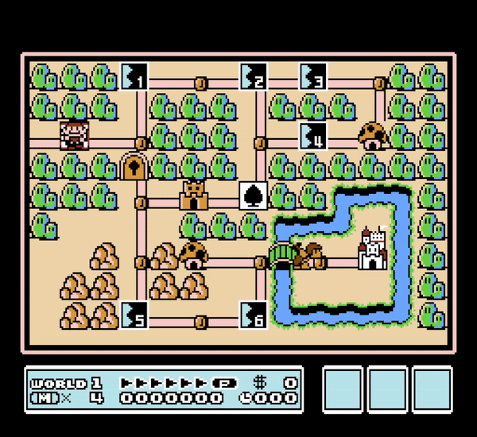
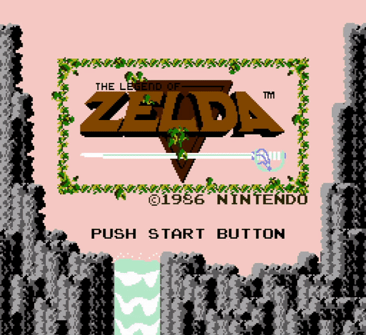
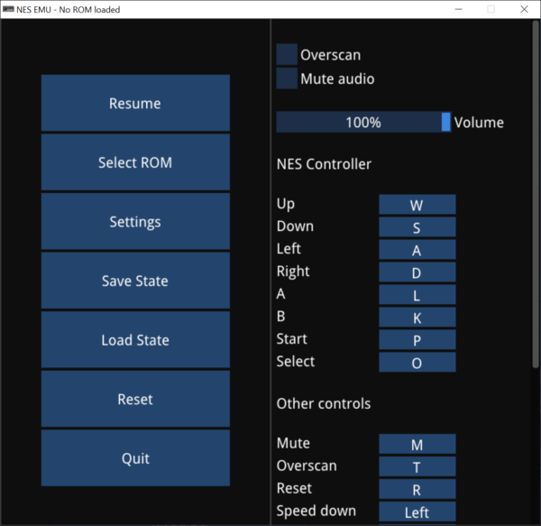
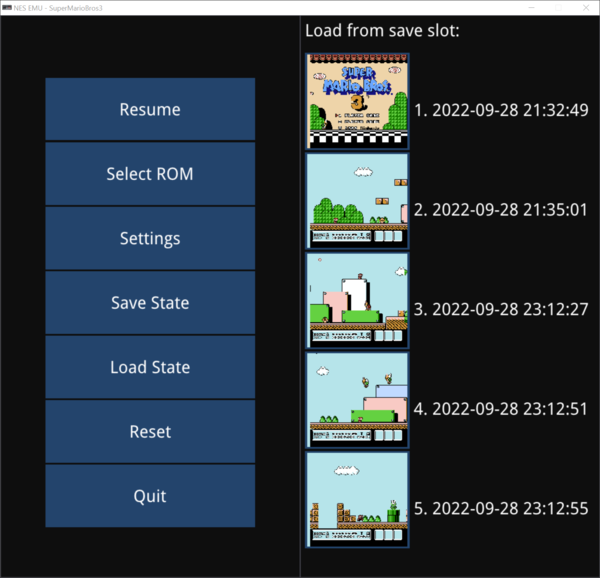

# NES EMU

This is an NTSC Nintendo Entertainment System emulator written in C++. It includes a cycle accurate MOS Technology 6502 (CPU) and a dot-based picture processing unit (PPU) to maximize game compatibility. Rendering and audio playback are implemented using SDL, and the GUI was created with DearImGui.

## Features
- Save state support for up to 5 slots per game. Creating a save state also takes a snapshot of the current frame. This snapshot is visible when choosing to load a save state.
- Automatically create/load save files for games that utilized battery-backed PRG RAM.
- Raise or lower CPU clock speed to speed up or slow down gameplay.
- Toggleable overscan to cut off top and bottom 8 rows of pixels. This can be used to hide rendering artifacts present in some games that relied on these scanlines being hidden by the TV.
- Rebindable hotkeys.

## Mappers

NES cartridges utilize different hardware to extend a game's capabilities. Cartridge types can affect the amount of PRG/CHR ROM, whether PRG RAM is available, and whether that RAM is battery-backed to allow for saving. They also allow for different bank sizes and bank swapping that extend the CPU's and PPU's respective address spaces. For more information on mappers, refer to https://www.nesdev.org/wiki/Mapper. The following mappers are supported:

- 0 - NROM
- 1 - MMC1
- 2 - UxROM
- 3 - CNROM
- 4 - MMC3
- 7 - AxROM
- 9 - MMC2

## Screenshots

## Dependencies

[SDL2](https://github.com/libsdl-org/SDL)  
[DearImGui](https://github.com/ocornut/imgui)  
[imgui-filebrowser](https://github.com/AirGuanZ/imgui-filebrowser)  
[md5](http://www.zedwood.com/article/cpp-md5-function)
